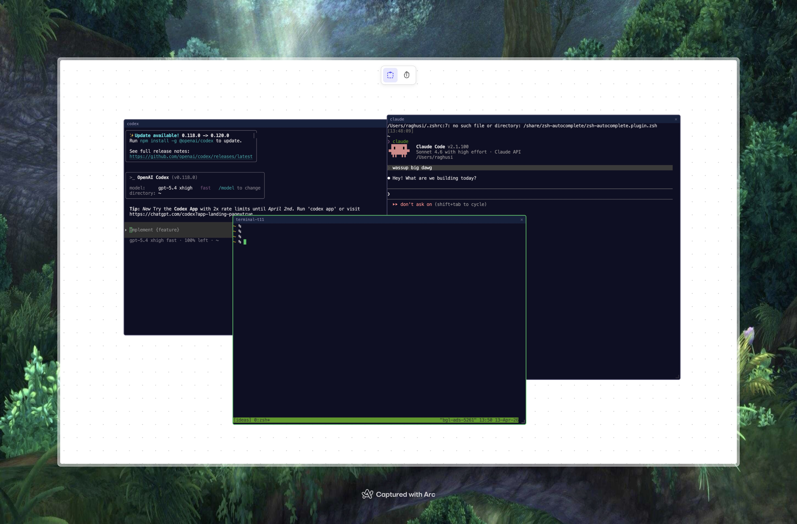

# floaterm

Draw terminals on an infinite canvas.



Like Excalidraw, but instead of shapes you draw terminal windows. Each box spawns a real shell session that you can type in, drag around, resize, and organize however you want.

## Features

- **Draw to spawn** - Click and drag on the canvas to draw a box. A real terminal appears at that size.
- **Drag & drop** - Grab the title bar to move terminals anywhere on the canvas.
- **Resize** - Drag the bottom-right corner handle.
- **Pan & zoom** - Scroll to pan, Ctrl/Cmd+scroll to zoom. Or use the hand tool (H).
- **Labels** - Click the title text to rename any terminal.
- **Focus management** - Click a terminal to bring it to front.
- **Persistent sessions** - Shell sessions survive page refreshes. Your running processes stay alive (like tmux).
- **Persistent layout** - Terminal positions, sizes, labels, and canvas state are auto-saved.
- **Zero telemetry** - Everything runs locally. Nothing leaves your machine.

## Quick start

```bash
git clone https://github.com/RaghuvirSingh23/floaterm.git
cd floaterm
npm install
npm start
```

Open **http://localhost:2323** and start drawing.

## Controls

| Action | Input |
|--------|-------|
| Draw terminal | Click + drag on canvas |
| Move terminal | Drag title bar |
| Resize | Drag bottom-right handle |
| Pan | Scroll / Hand tool (H) / Alt+drag |
| Zoom | Ctrl/Cmd + scroll |
| Focus | Click terminal |
| Rename | Click title text |
| Close | Click X button |
| Switch to draw tool | D |
| Switch to hand tool | H |

## Architecture

```
floaterm (1005 lines)
  server.js        - HTTP + WebSocket + PTY management + state persistence
  public/
    js/
      main.js      - Entry point, state save/restore
      canvas.js    - HTML5 Canvas rendering, pan, zoom, dot grid
      input.js     - Mouse/keyboard handling, draw/drag/resize/pan/zoom
      terminal-manager.js - xterm.js lifecycle, WebSocket connections
      box.js       - Box data model, serialization
    css/style.css  - All styling
    index.html     - Single page
```

**Stack:** Node.js, node-pty, ws, xterm.js (WebGL renderer), HTML5 Canvas, vanilla JS.

No frameworks. No bundler. No build step.

## How it works

1. A Node.js server on port 2323 serves static files and handles WebSocket connections.
2. Each terminal box gets a real PTY process (your default shell) via node-pty.
3. The frontend uses HTML5 Canvas for the dot grid and drawing interactions.
4. Terminal instances are xterm.js with WebGL rendering, positioned as DOM elements over the canvas.
5. PTY sessions persist on the server even when the browser disconnects - on reconnect, scrollback is replayed.
6. Layout state (positions, sizes, labels, canvas pan/zoom) is saved to `~/.floaterm/state.json`.

## License

MIT
